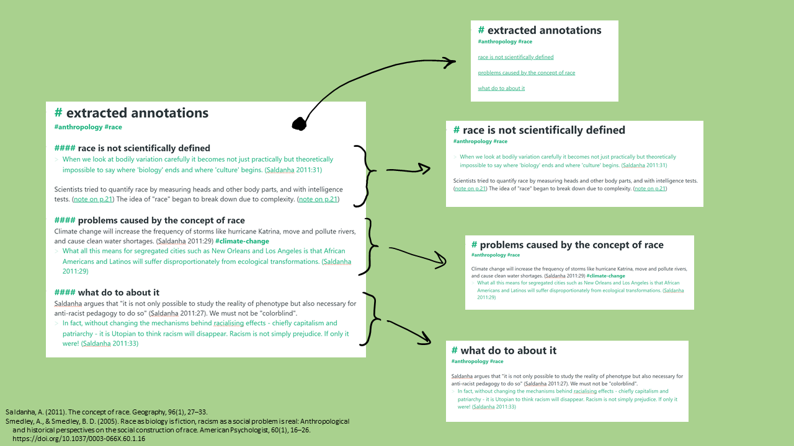

# Note Splitter

Split markdown files into multiple smaller files.

<a href="https://note-splitter.readthedocs.io/" target="_blank">Documentation</a>

## Features
* Split by almost any feature of text you can describe.
* Optionally copy some parts of a file into multiple new files when splitting (e.g. backlinks, tags, frontmatter, and/or footnotes).

Note Splitter is currently in the early phases of development. If this application sounds like it could be helpful to you, please [share your workflow](https://github.com/wheelercj/note-splitter/discussions/17) so we might be able to automate it! [Feature requests](https://github.com/wheelercj/note-splitter/issues), [discussions](https://github.com/wheelercj/note-splitter/discussions), etc. are welcome! Code and documentation contributions are currently not being accepted, but may be in the future.

