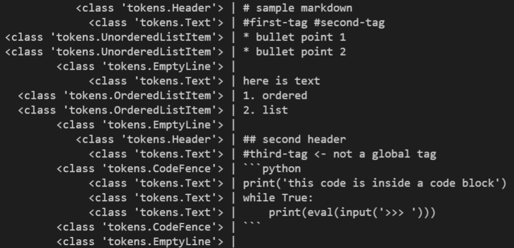
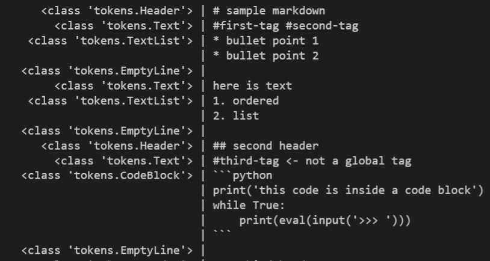
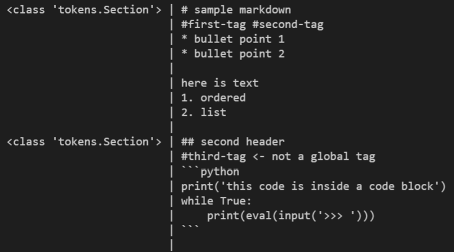

# developer overview

Here is a broad overview for developers of how Note Splitter's core splitting algorithm works.

## tokenization
After the user has selected which plain text file to split and what to split by, Note Splitter looks at the file and assigns a category to each line. This process is called **lexical analysis**, or **tokenization**. Some of the categories any given line can have are: header, blockquote, footnote, empty line, table row, etc. Each line and its category is combined into a **token**, which is what this program calls a variable representing one small part of a file and data about that part. Currently, each token only holds one line of the file, and all the tokens are in one list.

Here's an example that shows each line's token type on the left, and its plain markdown on the right:



Some features of plain text files can only be correctly understood by looking at their context. That is why the next step is to double-check the token types, this time comparing adjacent tokens. For example, a code block in a markdown file might contain a Python comment that, only without context, looks like a markdown header.

```python
print('this is code inside a code block, and . . .')
# this is a Python comment, not a markdown header.  
```

You can find all token types this program uses on the [tokens page](tokens.rst), see their [hierarchy](token-hierarchy.md), and see how this program tokenizes text in the [Lexer class](https://github.com/wheelercj/note-splitter/blob/master/note-splitter/lexer.py).

## parsing
Next, an optional step is to group together some tokens into larger tokens. Multiple consecutive table row tokens are put together into one table token, and two code fence tokens surrounding one or more text tokens become a code block token. This process is called **syntax analysis**, or **parsing**. The inner tokens are still tokens, but the overall token list is shorter and more organized now. (The reason why this step is optional is because sometimes the extra layer of organization is not needed and only makes operations a little more difficult.)

Here's an example that shows some of the token types combined:



Now we have a syntax tree. This data structure can simplify many operations such as splitting a file, merging multiple files, moving parts of a file around, etc.

Parsing occurs in the constructor of the AST (abstract syntax tree) class, which is in [parser_.py](https://github.com/wheelercj/note-splitter/blob/master/note-splitter/parser_.py).

## splitting
Note Splitter takes the syntax tree and the user's choice of what to split by, and divides the syntax tree into new tokens (in the code, they're called **Section** tokens). These section tokens are each a smaller syntax tree that is still easy to modify.

Here's an example with section tokens where the user chose to split by headers of all levels:



You can see the code for splitting in [splitter.py](https://github.com/wheelercj/note-splitter/blob/master/note-splitter/splitter.py).

After formatting and any final adjustments, the sections are converted back to plain text strings and saved into new files.

## further reading
Syntax trees are most often used to process code, but even though the resources below talk mostly about code, the ideas still apply to working with a plain text syntax tree.
* An excellent introduction to abstract syntax trees (ASTs) is given in [_ASTs - What are they and how to use them_](https://www.twilio.com/blog/abstract-syntax-trees). 
* Wikipedia explains [lexical analysis and related topics](https://en.wikipedia.org/wiki/Lexical_analysis) in great depth.
* An advanced and detailed resource covering all of the steps above and more can be found in [Crafting Interpreters](https://craftinginterpreters.com/scanning.html).
